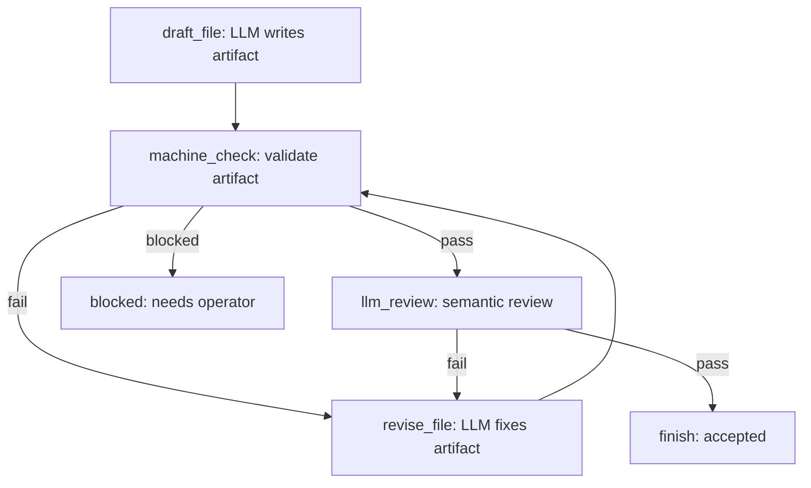

# Design: User-space Workflow Runtime

- **Requirement:** `docs/applications/workflow-runtime-requirement.md`
- **Owner:** user-space workflow runtime
- **Status:** approved

## Boundary Model

```text
Developer-authored WorkflowConfig
        |
        v
Canonical WorkflowDefinition
        |
        v
User-space Workflow Runtime
        |
        v
WorkflowRun / WorkflowNodeState / WorkflowRunLog
        |
        +--> Kernel public primitives
        |       turn.submit / invocation / tool / resource / job / budget / audit
        |
        +--> Application owners
                TaskGraph refs / connector actions / code intelligence / artifacts
```

Workflow Runtime is a platform/application owner. It is not kernel core, not
Model Gateway, not ToolGateway, and not TaskGraphOwner.

The runtime can pressure kernel primitives by using them inside node executors,
but it does not own those primitives. It records workflow facts and refs to
kernel facts. The kernel records kernel facts.

## Owner Responsibilities

Workflow Runtime owns:

- workflow config parsing;
- workflow definition loading and validation;
- canonical definition generation;
- definition identity and hash binding;
- flowchart projection generation and validation;
- run admission and idempotency;
- node lifecycle and node state;
- deterministic edge transition;
- run pause, resume, cancel, and terminal status;
- run logs, node metrics, artifact refs, and evidence refs;
- workflow projections for operators and applications.

Developer tooling owns:

- authoring workflow config;
- reviewing canonical definitions and generated flowcharts;
- replacing definitions for future runs;
- reviewing run logs;
- choosing node implementations and machine checks.

Kernel owns:

- admitted LLM invocations;
- provider context;
- tool execution and tool results;
- resource admission and resource reads;
- jobs and observations;
- BudgetLease;
- approval, sandbox, credentials, audit, memory truth, and checkpoints.

TaskGraphOwner owns:

- dynamic work topology;
- graph edits;
- dependency edges;
- node status;
- evidence attachment to work topology.

## TaskGraph And Workflow

TaskGraph is dynamic work topology. LLMs or applications may propose graph edits
while work is underway. TaskGraphOwner validates those edits and records the
accepted work topology.

Workflow is a developer-authored execution automaton. A workflow run follows one
definition snapshot until it reaches a terminal state. Nodes may produce
evidence that suggests a future workflow improvement, but they cannot apply that
improvement to the running definition.

The integration point is by reference:

```text
TaskGraph node
    source_workflow_run_ref -> workflow run

Workflow run
    source_graph_ref/source_node_ref -> dynamic work topology
```

Neither owner grants authority. Kernel CapabilityGrant controls execution.

## Data Shapes

`WorkflowConfig`:

- `workflow_id`
- `display_name`
- `initial_node_id`
- `nodes`
- `edges`
- `terminal_outcomes`
- `limits`
- `default_budget_policy_ref`
- `flowchart_layout_hints`

`WorkflowConfig` is developer-authored source. It can use YAML or JSON, but it
does not embed executable code, shell commands, prompt assembly, provider
payloads, or adapter protocol details. Node executors are selected through
registered `executor_ref` values.

`WorkflowDefinition`:

- `workflow_id`
- `definition_hash`
- `display_name`
- `nodes`
- `edges`
- `initial_node_id`
- `terminal_outcomes`
- `default_budget_policy_ref`
- `max_loop_count`
- `owner_scope`
- `flowchart_ref`
- `flowchart_hash`

`WorkflowNodeSpec`:

- `node_id`
- `node_kind`
- `input_schema`
- `output_schema`
- `allowed_outcomes`
- `capability_request`
- `budget_policy_ref`
- `retry_policy`
- `artifact_contract`

`WorkflowEdgeSpec`:

- `from_node_id`
- `outcome`
- `to_node_id`
- optional guard expression over workflow-owned run state

`WorkflowRun`:

- `workflow_run_id`
- `workflow_id`
- `definition_hash`
- `status`
- `current_node_id`
- `source_graph_ref`
- `source_node_ref`
- `started_at`
- `ended_at`
- `terminal_outcome`

`WorkflowNodeResult`:

- `node_id`
- `attempt`
- `outcome`
- `evidence_refs`
- `artifact_refs`
- `diagnostic_summary`
- `kernel_refs`
- `started_at`
- `ended_at`

`WorkflowFlowchart`:

- `workflow_id`
- `definition_hash`
- `format`: initially `mermaid`
- `source`: `generated` or `validated_author_supplied`
- `diagram_text`
- `diagram_hash`
- `render_hints`

`WorkflowFlowchart` is a projection from the executable definition. It is not a
second definition language. A workflow definition without a matching flowchart
is invalid for admission.

## Config Compilation

The loader converts developer-authored config into a canonical definition before
any run starts:

```text
WorkflowConfig
        |
        v
parse
        |
        v
validate node/edge/outcome/budget/capability shape
        |
        v
canonicalize ordering and defaults
        |
        v
WorkflowDefinition + definition_hash
        |
        v
FlowchartProjection
```

`definition_hash` is computed from the canonical compiled definition. Comments,
YAML key order, whitespace, and diagram layout hints do not change execution
identity. Changing a node, edge, allowed outcome, terminal state, loop limit,
budget policy ref, capability request, artifact contract, or executor ref
changes the definition hash and affects only new runs.

The config language remains declarative. It may reference a registered
`executor_ref`, `budget_policy_ref`, or `capability_request`; it may not contain
free-form code, arbitrary shell command templates, dynamic prompt assembly, or
provider-native payloads. If a workflow needs a new node capability, developers
register a node executor or application service and then reference it from
config.

Example config:

```yaml
workflow_id: document_review
display_name: Document Review
initial_node_id: draft

nodes:
  draft:
    kind: llm_invocation
    executor_ref: draft_writer
    allowed_outcomes: [completed, blocked]

  machine_check:
    kind: machine_check
    executor_ref: document_lint
    allowed_outcomes: [pass, fail, blocked]

  review:
    kind: llm_invocation
    executor_ref: reviewer
    allowed_outcomes: [pass, fail, blocked]

edges:
  - from: draft
    outcome: completed
    to: machine_check
  - from: machine_check
    outcome: fail
    to: draft
  - from: machine_check
    outcome: pass
    to: review
  - from: review
    outcome: fail
    to: draft
  - from: review
    outcome: pass
    to: done

terminal_outcomes:
  done: success
  blocked: blocked

limits:
  max_loop_count: 5
```

## Flowchart Projection

Every workflow has a diagram that reviewers and operators can read before they
trust the run. The preferred path is generation:

```text
WorkflowConfig
        |
        v
Canonical WorkflowDefinition nodes/edges
        |
        v
FlowchartProjection
        |
        v
Mermaid diagram for docs, review, and UI
```

If a developer provides a hand-written diagram, deployment tooling parses or
checks it against the definition. The check must prove that each executable node
appears once, every declared edge appears with its outcome label, every terminal
state appears, and every visible loop has a declared retry or loop limit. The
diagram may contain layout hints, but it cannot contain edges that the runtime
will not execute.

Example:



The runtime can project live state onto the same graph by marking the current
node, completed nodes, failed edges, retry count, terminal state, and evidence
refs. That projection remains a view. It does not change the workflow
definition.

## Execution Model

The runner executes one node at a time unless a definition explicitly declares a
parallel branch and a deterministic join. Phase A and Phase B should remain
serial.

For each node:

1. Load the node spec from the bound definition snapshot.
2. Validate input against the node schema.
3. Resolve the node executor from developer configuration.
4. Execute the node under its declared capability request and budget policy.
5. Record a `WorkflowNodeResult`.
6. Match the result outcome to exactly one declared edge or terminal outcome.
7. Advance run state or fail closed.

The executor returns node evidence. It does not return an edited workflow graph.

## Node Kinds

`llm_invocation` submits a bounded request through kernel invocation or turn
primitives. The node receives final text, structured output, and kernel refs. It
does not assemble provider context.

`machine_check` runs deterministic validation through application code,
resource checks, code intelligence, or kernel-governed tools when needed.

`human_approval` creates an application-level waiting state or uses a kernel
approval primitive when the requested action is a kernel-governed effect.

`tool_operation` calls a kernel-governed generic tool through public primitives.
It cannot bypass ToolGateway.

`resource_transform` produces or transforms artifacts through application code
or kernel resource primitives and returns resource refs.

`connector_action` delegates external delivery to an application connector
runtime and records connector action/receipt refs.

`subworkflow` starts another workflow run and waits for its terminal projection.

## Failure And Recovery

Unknown node id, unknown outcome, missing edge, invalid schema, node executor
mismatch, loop-limit exhaustion, and capability mismatch fail closed.

Retry is declared in the node spec. A node cannot create a retry policy at
runtime. If a retry crosses a kernel effect boundary, idempotency uses kernel or
connector refs instead of repeating effects.

Resume uses the stored run state and the bound definition hash. If the current
definition file changed on disk, the run still resumes against the original
snapshot. If the original snapshot is unavailable, the run becomes
`blocked_definition_unavailable` and waits for operator repair.

## Logs And Optimization

Run logs are workflow owner facts. They should record:

- node durations;
- attempts and retry causes;
- outcome counts;
- edge traversal counts;
- loop counts;
- BudgetLease usage summaries;
- tool and job refs;
- artifact revisions;
- machine-check failures;
- LLM reviewer disagreement;
- human approval latency;
- terminal cause.

Developers use logs to revise workflow definitions. The runtime does not feed
logs back into a running definition as self-modification instructions.

## Boundary Tests

Workflow tests should prove:

- config compiles into a canonical definition before admission;
- definitions are immutable for a run;
- each accepted definition has a matching flowchart projection;
- flowchart edges cannot add executable transitions;
- stale flowchart hashes block admission;
- nodes cannot return graph edits as executable workflow changes;
- unknown outcomes fail closed;
- loop limits are enforced;
- old runs resume against the original definition hash;
- workflow runtime does not import kernel internals;
- kernel does not import workflow runtime;
- skills do not bind tool availability;
- tools do not imply skill loading;
- TaskGraph edits remain dynamic work topology and do not alter workflow
  definition snapshots.
